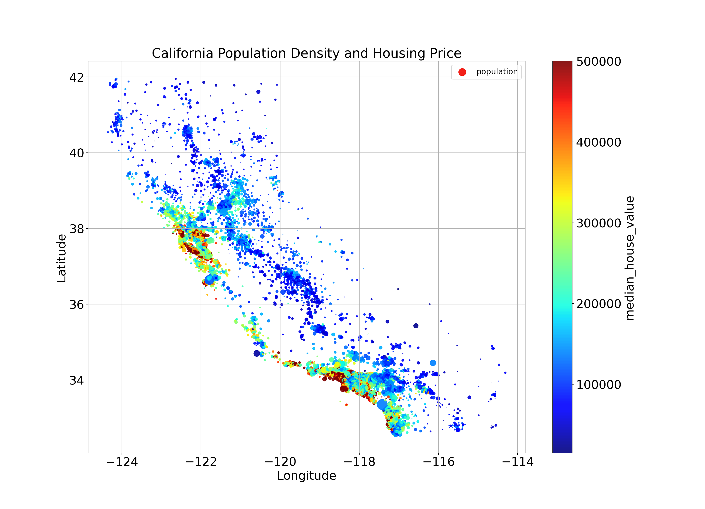

<h1 style="text-align: center">California Housing Census Project</h1>

<p style="text-align: center">Author: Jose Pena</p>
<p style="text-align: center">Github: <a href="https://github.com/JoseJuan98">JoseJuan98</a></p>



## Aim of the Project

The primary goal of this project is to demonstrate that it is feasible to achieve high-quality analysis and solutions by
adhering to sound engineering practices without significantly increasing time or effort. In fact, in the long run, these
practices are likely to save considerable time when transitioning a Proof of Concept (PoC) to production.

I aim to challenge the common misconception that one must choose between rigorous academic standards and efficient
engineering practices. Through this project, I will showcase my ability to excel in both domains simultaneously.

Furthermore, I intend to illustrate that while Jupyter Notebooks are excellent tools for exploratory analysis and other
experimental tasks, they are not always necessary. By separating the implementation and findings from the presentation,
we can allow for more flexible exploration without being constrained by how the results will be presented. This approach
not only facilitates a clearer and more focused analysis but also enables the findings to be presented in various
formats, making them accessible to non-technical stakeholders.

The project will highlight my comprehensive skills as a Machine Learning (ML) Engineer, which encompasses a blend of
Computer Science, Data Science, Data Engineering, and DevOps. This role also involves a combination of specific skills
from these fields, such as ML, MLOps, Deep Learning, Cloud technologies, along with shared competencies like Statistics
and storytelling.

More specifically, I aim to demonstrate my capability to develop a robust and effective Machine Learning system. This
involves managing the entire lifecycle from the exploratory and modeling phases—emphasizing statistical analysis and
best practices in ML—to the engineering phase where the system's dependencies are containerized and prepared for
deployment in a production environment. Throughout this process, I will provide clear and actionable insights in a
business context for non-technical stakeholders.

# Project Highlights

## Note of interest

- For the presentation of the findings and results of the analysis carried out check `docs/reports/`, e.g. you can find
  the Regression Analysis and the Exploratory Data Analysis reports.
- For technical documentation related with installation, microservice, etc check in `docs/`
- For the code related to any part check `src/`

## Interesting Results

The initial experiments conducted compared the performance of Linear Regression and Neural Network models on the
California Housing dataset. The results revealed that the Linear Regression model outperformed the Neural Network model,
affirming the initial hypothesis. This hypothesis posited that simpler linear models, such as Linear Regression, would
yield better results than more complex non-linear models like Neural Networks, particularly in smaller datasets where
linear relationships are more pronounced.

It is crucial to acknowledge that the project's focus was primarily on model performance. Other factors, such as
training time and memory usage, were not evaluated but could significantly impact the practical application of these
models.

During a more thorough analysis and deeper engagement with the dataset, I recognized that data points initially
considered as statistical outliers were, in fact, crucial for understanding the underlying patterns. This discovery
underscored the importance of a meticulous analysis phase and a profound comprehension of the dataset to produce
reliable and consistent results.

With additional time, it would have been beneficial to delve deeper into techniques for encoding geospatial data and to
conduct further tests on the `ClusterSimilarityEncoder`. Exploring these areas could provide more insights and allow for
the presentation of visualizations demonstrating how these techniques enhance model performance and data interpretation.

## Dataset

The California Housing dataset, derived from the 1990 census data, is a comprehensive collection of demographic and
housing information for the state of California, USA. It is structured such that each row corresponds to a census block
group, which is the smallest geographical unit for which the U.S. Census Bureau publishes sample data. Typically, a
block group has a population ranging from 600 to 3,000 people.

This dataset was meticulously compiled by R. Kelley Pace and Ronald Barry for their 1997 research paper titled "Sparse
Spatial Autoregressions," published in the Statistics and Probability Letters journal. The dataset features a variety of
variables, including median income, median house age, and median number of rooms per house, among others. The primary
variable of interest, or the dependent variable for this analysis, is the `median_house_value`, which indicates the
median price of homes in each block group.

The California Housing dataset is publicly accessible
through [Luís Torgo's page](https://www.dcc.fc.up.pt/~ltorgo/Regression/cal_housing.html) at the University of Porto. It
is frequently utilized in regression analysis and machine learning projects to model and predict housing prices based on
demographic and economic factors. This dataset not only serves as a valuable resource for academic and professional
research but also provides insights into the economic conditions of different communities within California during the
early 1990s.

## File Structure

```shell
.
│
├── artifacts           # Stores data used for cases (not necessary to store in repository, as the data is available by web)
│     
├── notebooks           # Notebooks used for exploration, experimentation, analysis, to finally produce the final model and put it into a production environment
│     │     
│     ├── ExploratoryDataAnalysis.ipynb     # Exploratory data analysis to discover insights and features about the variables used
│     │     
│     ├── RegressionAnalysis.ipynb         # Modeling experimentation to discover the most suitable models and fine-tune hyperparameters
│     │     
│     ├── Explainability.ipynb             # Explanation or brief understanding of the final model, parameters (variables), and hyperparameters 
│     │     
│     └── Old.ipynb                        # Previous work done (first ML case in 2019), kept to show myself how much I improved in the last years
│     
├── docs              # Contains generated reports
│     │ 
│     ├── diagrams/                            # Contains diagrams used in the reports
│     │     
│     ├── Microservice_Development...md        # Documentation for the development and deployment of the microservice
│     ├── ML_Life_Cycle.md                     # Documentation for the Machine Learning Life Cycle
│     ├── README.md                            # Explanation of the documents in the folder
│     ├── Report_Final_Project.md              # Final report of the project
│     └── reports
│           ├── ExploratoryDataAnalysis.pdf    # Exploratory Data Analysis report
│           └── RegressionAnalysis.pdf         # Regression Analysis report
│     
└── src                  # Source code for the project
    ├── analysis           # Contains the code for the analysis phase
    ├── common             # Contains the common code for the project
    ├── exper              # Contains the code for the experimentation library
    ├── experiments        # Contains the code for the experiments phase
    ├── main.py            # Main file to run the experiments
    ├── microservice       # Contains the code for the microservice
    ├── pipeline           # Contains the code for the data wrangling, feature engineering, model training and evaluation pipeline
    └── test               # Contains the tests for the project
```

`exper` is a library created following Object-Oriented Programming (OOP) for making easier to experiment with different
models using the same data to be able to have consistent and reliable results.

## Setup

To set up the project, follow the instructions in the [Setup Guide](docs/Setup_Guide.md).

## License

This project is licensed under the MIT License. See the [LICENSE](LICENSE) file for more details.

## Further Work - Check list

This check-list shows the phases of the project that have been completed and the next steps:

- [X] Exploratory Data Analysis
- [X] Regression Analysis/Machine Learning Modelling
- [ ] Apply best practices:
    - [ ] `TargetTransformer`
    - [ ] Simplify the code and structure in src, e.g. move all the code to a package "common", including "exper" under
      "common", instead of having an environment.yaml, setup.cfg and setup.py have only a pyproject.toml for poetry
    - [ ] move `exper.constant` to `config.toml`
    - [ ] Use a python packaging and dependency manager like poetry
    - [ ] Make Github Actions for CI pipeline to lint and test before each Pull Request.
    - [ ] Use a logger instead of print statements, and store the logs in a file in `artifacts/logs/`
    - [x] Make a decisions document explaining the importance of this decision
    - [ ] Subtituing notebooks for python scripts and Markdown files for report
    - [ ] Explain the reasons why this is better (better sharing, better documentation, better modularity since day
      0, ...)
- [ ] API and FrontEnd development to expose the final model -> In progress
- [ ] Containerization of the API to enable deployment it in any environment
- [ ] MLOps - Continuous Integration, Deployment and Training (CI CD CT) pipeline for ML operations

Other ideas to try in the project:

- Use [hiplot](https://github.com/facebookresearch/hiplot) for high-dimensional data visualization using parallel
  coordinates.
- Use [localstack](https://localstack.cloud/) for provisioning cloud services locally.
- Use distributed ML tools like PySpark/Dask with Scalene Profiler to see if it improves training times and results
- Develop 2 microservices that depend on each other to expose the model (one in Scala, another in Python for
  interoperability) and use ONNX for cross-platform models
- Consider using GPU computing frameworks with native serving libraries to improve inferences using Scalene Profiler,
  even if it's overkill. e.g. with skorch.
- Create a simple website to test different models with several microservices

## Evaluation Metrics

In a regression analysis project, selecting appropriate evaluation metrics is crucial to determine the performance of
the model. The evaluation metrics used for this project are:

- **Mean Squared Error (MSE)**: This metric calculates the average squared difference between the predicted and actual
  values. It penalizes larger errors more heavily than smaller ones.

- **Root Mean Squared Error (RMSE)**: This is the square root of the MSE, which gives us a measure of the average
  magnitude of the error in the same units as the target variable.

- **Mean Absolute Error (MAE)**: This metric calculates the absolute difference between the predicted and actual values,
  taking the average over all samples.

- **R-squared (R2)**: This metric measures the proportion of variance in the target variable that can be explained by
  the model. It ranges from 0 to 1, with higher values indicating better performance.

When selecting an evaluation metric, it is important to consider the nature of the problem and the context of the
application. For instance, if the cost of false negatives is much higher than false positives, it is preferable to
optimize for reducing the MSE for values below a certain threshold.

Similarly, if we are interested in identifying extreme values of the target variable, we may prefer to use the MAE
instead of the MSE. It is also essential to consider
the range and distribution of the target variable and any specific requirements or constraints of the project.

The selection of the most appropriate evaluation metric can help to ensure that the model meets the desired level of
performance for the given task.

## Results

## Model Interpretation

## Usage

The project can be used in two ways:

### 1. Jupyter Notebooks

To run the Jupyter notebooks, create a virtual environment and install the required packages as shown below:

```shell
# Install a python virtual environment manager
pip install virtualenv 
python -m virtualenv venv  

# Activate the virtual environment
source ./venv/bin/activate # Linux 
./bin/Scripts/activate     # Windows   

# Install the dependencies
python -m pip install -U pip pip install --no-cache-dir -r requirements/analysis.txt
```

Then navigate to the notebooks folder and launch Jupyter:

```shell
cd notebooks 
jupyterlab <notebook>
```

### 2. Microservice with API

Check [Microservice documentation](docs/Microservice_Development_and_Deployment.md)

[comment]: <> (For the MLOps phase check: https://github.com/outerbounds/full-stack-ML-metaflow-tutorial)

[comment]: <>(
use capitulo 10 from libro hands-on to make a better NN for this problem
ncise and informative insights in a business-manner for non-technical stakeholders.
)

[comment]: <> (
    Description of the dataset: Add a brief overview of the dataset used for this project, including information on the source, size, and format of the data.
    Explanation of the evaluation metric: If you are using a specific evaluation metric to measure the performance of your model, it might be helpful to provide an explanation of how it works and why you chose it.
    Results: Include a summary of the results you obtained during the experimentation phase. You could add tables or visualizations to make it easier to interpret and understand the results.
    Model interpretation: If you have used any techniques to interpret your model, such as feature importance or SHAP values, consider adding a section to your README that explains what you did and why it is important.
    Deployment instructions: When you are ready to deploy your model, include instructions on how to set up the API and containerize the application. This can be helpful for anyone who wants to reproduce your work or use your model in their own applications.
    Future work: Finally, it can be useful to include a section that outlines potential future work that could be done to improve the model or extend the project. This can give readers an idea of where the project could go next and inspire them to contribute their own ideas.
)

