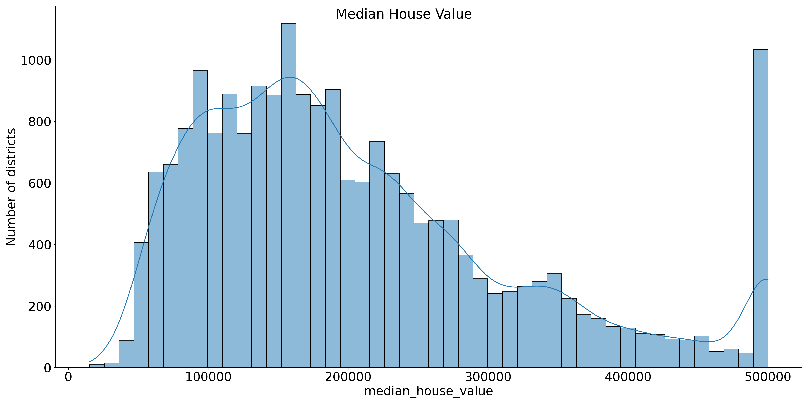
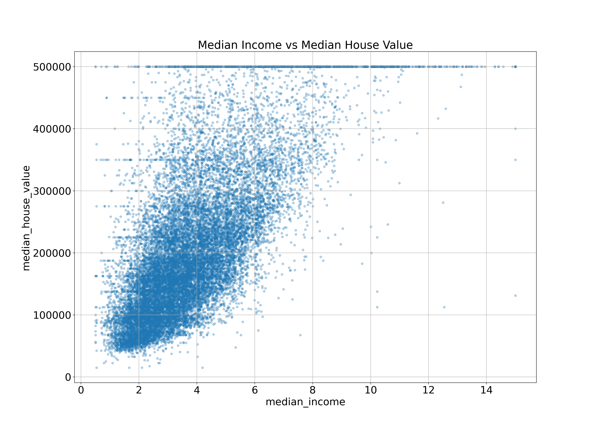
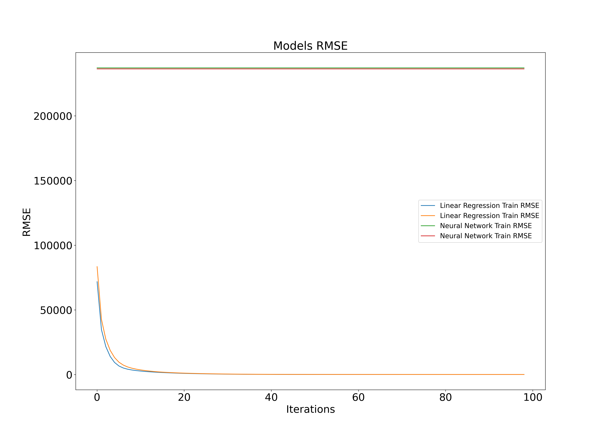
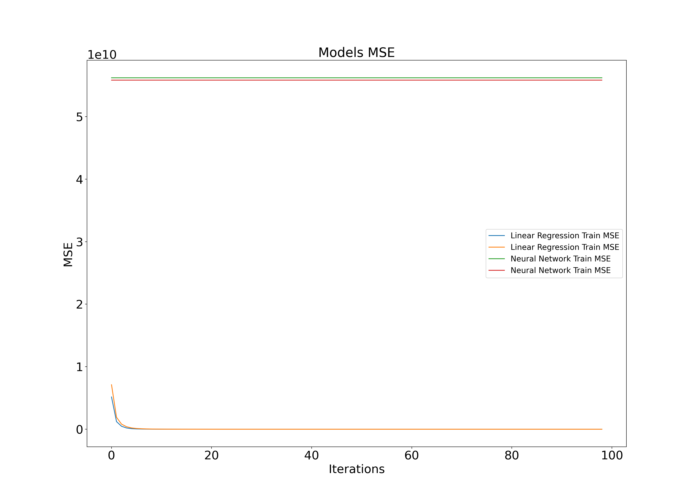
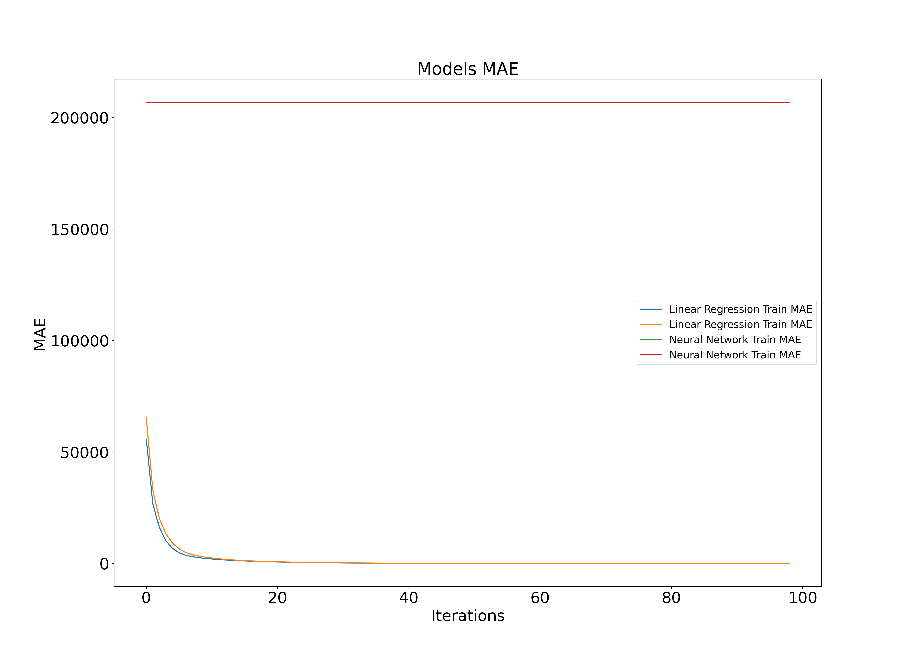

<h1 style="text-align: center" > Final Report </h1>  
<h2 style="text-align: center" > Linear Regression vs Neural Network </h2>

 

# Index

#TODO...

 
 
 
 
 
 
 

# Introduction

This report presents the findings of a comparative analysis between Linear Regression and Neural Network models for
predicting the median house value based on the California census data. The project involved various steps including
development of a library to automate most of the work, exploratory data analysis, data cleaning, feature engineering,
model training, and performance evaluation.
The code was implemented following good coding practices as recommended by PEP 8 [1] and Google Python coding style [2].
The objective of this project was to test the formulated hypothesis while addressing the challenges associated with
comparing Machine Learning (ML) algorithms and to provide an analysis of the results.

# Methodology

The methodology for this project was centered around working with the data, applying ML algorithms, and producing
results to compare the performance of linear and non-linear models. The code contains most of the insights, and this
report highlights the main findings of the project.

# California Census Housing Study

## Hypothesis

The hypothesis for this study was that simple linear models like linear regression would perform better compared to
complex non-linear models, like neural networks, on small datasets due to the presence of linear patterns. This
hypothesis and the results are presented later in the study.

## Dataset

The California Housing dataset used in this study was compiled using the 1990 California census data provided in Luís
Torgo's page at the University of Porto \[[3](https://www.dcc.fc.up.pt/~ltorgo/Regression/cal_housing.html)\].

This dataset appeared in a 1997 paper titled "Sparse Spatial Auto-regressions" by Pace, R. Kelley and Ronald Barry [4],
published in the Statistics and Probability Letters journal. They built it using the 1990 California census data. The
dataset contains one row per census block group, the smallest geographical unit for which the U.S. Census Bureau
publishes sample data. Each block group typically has a population of 600 to 3,000 people.

The dataset contains several features, including the median income, median house age, and median number of rooms per
house, among others. The target variable for this analysis is the `median_house_value`, which represents the median
price of the houses per block group.

## Implementation

### Exper library

For this project, a library called `exper` was developed following Object-Oriented Programming (OOP) principles. This
library facilitated the experimentation with different models using the same preprocessed data, ensuring consistent and
reliable results.

Figure 1. exper library Class Diagram.

The core class of the library is 'Experiment', which defines the models to test, the metrics to use for those models,
and a 'DataHandler' and a 'Preprocessor' for obtaining and preprocessing the data. This setup allows for running an
experiment to compare the model metrics, visualize them, and conduct hypothesis testing.

### Exploratory Data Analysis

Taking in consideration accessibility issues for visualization, such as color blindness, the color blind friendly
colormap “viridis" was used in `matplotlib`, which is the one by default. On the contrary it's not used by default in
`seaborn`, so `seaborn` was configure to use the same colormap.

Below the geospatial data can be visualized by the California population density and housing price on a map. The plot
represents the sample points with red indicating expensive prices, blue indicating cheap prices, and larger circles
indicating areas with a larger population.

Figure 2. California Population Density and Housing Price.

The plot reveals a potential relationship between housing prices, location, and population density. Houses close to the
ocean and in areas with high population density appear to have higher values. This suggests that the ocean proximity
variable could be a significant predictor in the models.

Further, the distribution of the target variable, median house value was examined. The distribution is skewed to the
right, with a skewness value of 0.9778. This skewness is significant as Linear Regression models assume that errors are
normally distributed.

Figure 3. Distribution of the Median House Value

The distribution also reveals that the highest value (500.000) has a similar frequency to the most frequent value in the
middle of the distribution. This is due to a hardcoded threshold on that value (500.000), meaning that every value
higher than 500.000 is recorded as 500.000. This results in a multimodal distribution, which can be addressed by
creating a feature called "is_higher_median_income" that indicates whether the value is higher than 500.000.

The histogram of the rest of the numerical variables provides more insights into the data.

Figure 4. Distribution of the variables

Looking at this, it seems that the housing median age, as the median house value, was also capped at 50. Further, the
median income it's in some scale from 0 to 15.

Most of the variables appear to be skewed to the right, which will be addressed in the feature engineering phase. The
housing median age and the median house value were both capped at 50, and the median income is scaled from 0 to 15.

#### Correlations

The correlations between the variables and the house value are:

| Variable           | Correlation with House Value |
|--------------------|------------------------------|
| median_income      | 0.688075                     |
| total_rooms        | 0.134153                     |
| housing_median_age | 0.105623                     |
| households         | 0.065843                     |
| total_bedrooms     | 0.049686                     |
| population         | -0.024650                    |
| longitude          | -0.045967                    |
| latitude           | -0.144160                    |

Table 1. Correlations with House Value

Looking at the correlations, the most correlated variable with the house value is the median income, as shown in the
plot below.

Figure 5. Median Income vs Median House Value 

The plot shows an upward trend between the median income and the median house value, indicating a positive correlation.
The points are not too dispersed, suggesting a strong relationship. The house value threshold is also visible in the
upper part of the plot.

### Data cleaning and Feature Engineering

The data cleaning phase involved handling missing values in the dataset. Specifically, there were 207 missing values in
the 'total_bedrooms' variable. These missing values were imputed using the median value of this variable.

The feature engineering phase focused on addressing the skewness in some of the variables and creating new variables
that could potentially improve the performance of the models. As observed in the exploratory data analysis, several
variables were skewed. To address this, a log transformation was applied to these variables. The log transformation is a
simple method for reducing skewness in data meanwhile not losing much interpretability.

In addition, new variables were created by combining existing ones. Given that the dataset is based on the median value
of the variables per district, it was expected that the combination of some variables with the number of households
could provide useful information. Therefore, new variables 'rooms_per_household', 'bedrooms_ratio', and '
people_per_household' were created by computing the ratio between those.

The correlations between these new variables and the house price are the following:

| Variable            | Correlation with House Price |
|---------------------|------------------------------|
| median_income       | 0.688075                     |
| rooms_per_household | 0.151948                     |
| total_rooms         | 0.134153                     |
| housing_median_age  | 0.105623                     |
| households          | 0.065843                     |
| total_bedrooms      | 0.049686                     |
| people_per_house    | -0.023737                    |
| population          | -0.024650                    |
| longitude           | -0.045967                    |
| latitude            | -0.144160                    |
| bedrooms_ratio      | -0.255880                    |

Table 2. Correlations with House Price after combining variables 

The 'bedrooms_ratio' variable, which represents the ratio of bedrooms to total rooms, showed a higher correlation with
the house value than the total number of rooms or bedrooms. This suggests that houses with a lower ratio of bedrooms to
total rooms tend to be more expensive.

### Modeling

#### Linear Regression (LR)

For this project, the Lasso model from the sklearn library was used for the Linear Regression. Lasso, or Least Absolute
Shrinkage and Selection Operator, is a regression analysis method that performs both variable selection and
regularization. This helps to enhance the prediction accuracy and interpretability of the statistical model it produces.
The Lasso model was chosen for this project because it has the parameter `max_iter`, which allows for the comparison of
metrics with the Neural Networks over iterations.

#### Neural Network (NN)

The Neural Network model used in this project was implemented using the Keras library. The network architecture
consisted of an input layer, multiple hidden layers, and an output layer. Each layer uses a ReLU function except the
output layer which uses a sigmoid function, and the model was trained using the "Adam" optimizer and mean square error
as the loss function. Also, each layer has 'l2' regularization to make it as similar as possible to the Lasso Regression
model, and a dropout layer to try to improve overfitting.

#### Metrics for Regression

Selecting appropriate evaluation metrics is crucial to determine the performance of the model. The evaluation metrics
used for this project are:

- **Mean Squared Error (MSE)**: This metric calculates the average squared difference between the predicted and actual
  values. It penalizes larger errors more heavily than smaller ones.
- **Root Mean Squared Error (RMSE)**: This is the square root of the MSE, which gives us a measure of the average
  magnitude of the error in the same units as the target variable.
- **Mean Absolute Error (MAE)**: This metric calculates the absolute difference between the predicted and actual values,
  taking the average over all samples.

When selecting an evaluation metric, it is important to consider the nature of the problem and the context of the
application. For instance, if the cost of false negatives is much higher than false positives, it is preferable to
optimize for reducing the MSE for values below a certain threshold. Similarly, if we are interested in identifying
extreme values of the target variable, we may prefer to use the MAE instead of the MSE. In this case the three of them
were selected to have a broader space for comparisons.

### Hypothesis testing

The hypothesis testing phase involved comparing the performance metrics of the Linear Regression and Neural Network
models. On a more formal definition the Null and Alternative Hypothesis, being the sample population, $\mu_{1}$ the
performance metrics over iterations of a linear model and $\mu_{2}$ the performance metrics over iterations of a neural
network, are:

- The Null Hypothesis $H_0: \mu_{1} <= \mu_{2}$ represents that the performance metrics of a linear model are less or
  equal than the ones of the neural network.
- The Alternative Hypothesis $H_1: \mu_{1} > \mu_{2}$ represents that the performance metrics of a linear model are
  higher than the ones of the neural network.

The t-test was used to compare the values of the populations. If the calculated t-values fell into the area on the right
side of a distribution curve, this would lead to the rejection of the null hypothesis. The null hypothesis could also be
rejected if the p-value was smaller than the significance level of 0.05.

The statistical tests were computed only using the test set, but the plots are displayed with both the test and train
sets.

Figure 6. Models RMSE metric 

Figure 7. Models MSE metric 

Figure 8. Models MAE metric

In conclusion, the plots clearly show that the Linear Regression model outperforms the Neural Network model. However, a
more rigorous analysis was conducted to formally test the statistical significance the null hypothesis. The t-test for
the RMSE metric resulted in a p-value of 7.8e-242, which is less than the significance level of 0.05. Therefore, the
null hypothesis was rejected, indicating that the Linear Regression model performs better than the Neural Network model.
Similar results were obtained for the other metrics.

# Discussion

In the initial analysis after plotting the boxplot of each variable and seeing that there are a lot of outliers, these
were removed using the 99th percentile, but this hurt performance a lot. Latter after a more detailed analysis, it was
discovered that some of the variables, including the target variables, are capped at a certain value and have several
modes (peaks), which were causing the appearance of outliers. Instead of removing these outliers, they were kept in the
data, which improved the performance of the models. This experience shows the importance of a proper understanding of
the data before making decisions about data cleaning and preprocessing.

# Conclusion

The main goal of this project was to compare the performance of a Linear Regression and a Neural Network models on the
California Housing dataset. The results demonstrated that the Linear Regression model outperformed the Neural Network
model, supporting the initial hypothesis. However, it's important to note that the scope of the project was limited to
the performance of the models, and other factors such as training time and memory usage were not considered.

As mentioned in the previous section, after a more detailed analysis and getting to know better the data I discovered
that what I was treating "statistically" as outliers, in reality were valuable information. This made me realize the
importance of the analysis phase and the understanding on the data for producing reliable and consistent results.

Given more time, it would have been interesting to explore more in detail techniques to encode geospatial data and
further test the 'ClusterSimilarityEncoder' to gather more insight and show some visualizations of how it works.

# Data Ethics

In terms of data ethics, the California Housing dataset does not raise any significant concerns. The dataset was
computed using the median of variables per district, thus does not contain any personal data. However, it's important to
note that even when working with aggregated data, ethical considerations should not be overlooked. Concerns should be
taken care to ensure that the data is used responsibly, and that the results of the analysis do not lead to unfair or
discriminatory outcomes.

## Data Ethics Reflection

Data ethics is a crucial aspect of any data-driven project, and it becomes even more important when the dataset is not
publicly available. In such cases, several ethical considerations come into play, including data ownership, access,
storage, processing, and the potential societal impact of the analysis.

### Data Ownership and Access

In the case of the California Housing dataset, if it were not publicly available, it would be essential to obtain
explicit permission from the data owners before accessing and using the data. This could involve negotiating a data
usage agreement that clearly outlines what the data will be used for, who will have access to it, and any restrictions
on its use.

### Data Storage

The storage of the data is another critical consideration. The data should be stored securely to prevent unauthorized
access and potential data breaches. This could involve using encrypted storage solutions and implementing strict access
controls. Additionally, the data should be stored in a way that complies with any relevant data protection laws and
regulations.

### Data Processing

The processing of the data should be done in a way that respects the privacy and confidentiality of the individuals or
entities that the data pertains to. This could involve anonymizing the data to remove any personally identifiable
information or using aggregation techniques to present the data in a way that individual records cannot be identified.

### Analysis and Societal Impact

The analysis performed on the data should be conducted ethically and responsibly. This means avoiding any analysis that
could lead to unfair or discriminatory outcomes. It's also important to consider the potential societal impact of the
analysis. For example, if the analysis of the housing data were to reveal patterns of housing inequality, this could
have significant implications for housing policy and social justice.

In conclusion, while data-driven projects can provide valuable insights and drive decision-making, it's crucial to
approach these projects with a strong commitment to data ethics. This involves respecting data ownership, ensuring
secure and responsible data storage and processing, and considering the potential societal impact of the analysis.
 

# References

[1] “PEP 8 — Style Guide for Python
Code.” [https://www.python.org/dev/peps/pep-0008/e](https://www.python.org/dev/peps/pep-0008/e). Accessed: 2024-03-11.

[2] “Google Python Style
Guide.” [https://google.github.io/styleguide/pyguide.html](https://google.github.io/styleguide/pyguide.html). Accessed:
2024-03-11

[3] "California Housing dataset from Luís Torgo (University
Porto)." https://www.dcc.fc.up.pt/~ltorgo/Regression/cal_housing.html. Accessed: 2024-03-11

[4] "Sparse Spatial Auto-regressions - Pace, R. Kelley and Ronald Barry " https://doi.org/10.1016/S0167-7152(96)00140-X