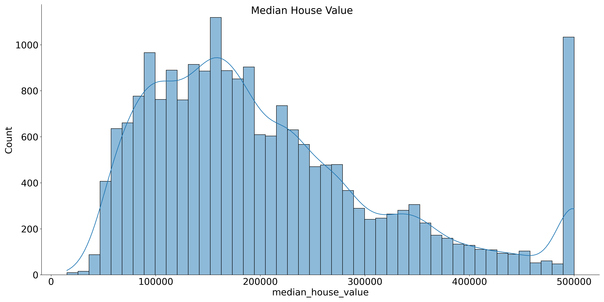
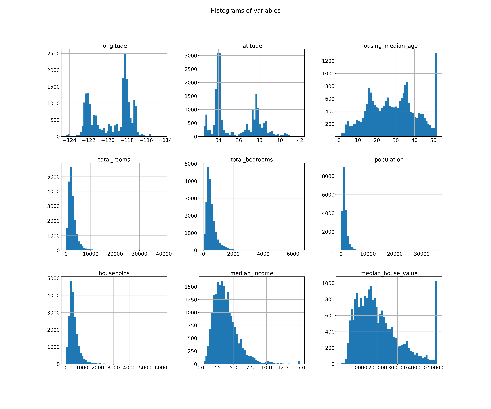

<h1 style="text-align: center" > D7054E Final Project Report </h1>  

 Jose Juan Pena Gomez (jospen-3)  
  
<h4 style="text-align: center" > Individual Project </h4>  
<h3 style="text-align: center" > March 17, 2024  </h3>
# Introduction

This report is based on the final project,

#TODO ...

The results are presented in the form of graphs, followed by a discussion of the results and a conclusion. The code is implemented following good coding practices as PEP 8 [1] and Google Python coding style [2], and its design intends to solve the challenges present while comparing machine learning algorithms.

# Methodology

the methodology is centered around working with the data, applying machine learning algorithms and producing results to be compared. The code has most of the insights, so this report is the synthesis of it containing the main highlights.

# California Census Housing Study

## Dataset

This California Housing dataset is available from Luís Torgo's page \[[3](https://www.dcc.fc.up.pt/~ltorgo/Regression/cal_housing.html)\] (University of Porto).  
  
This dataset appeared in a 1997 paper titled "Sparse Spatial Auto-regressions" by Pace, R. Kelley and Ronald Barry [4], published in the Statistics and Probability Letters journal. They built it using the 1990 California census data. It contains one row per census block group. A block group is the smallest geographical unit for which the U.S. Census Bureau publishes sample data (a block group typically has a population of 600 to 3,000 people).
  
The target variable or dependent variable for this analysis will be the `median_house_value`, which describes the median price of the houses per block group.  
  
The California Housing dataset is a collection of census data for the state of California, USA, from the 1990 census.   
It consists of one row per census block group, with each block group representing the smallest geographical unit for which sample data is published by the U.S. Census Bureau. The dataset was compiled by Pace and Barry and published in the Statistics and Probability Letters journal in 1997.   
  
The dataset contains several features, including the median income, median house age, and median number of rooms per house, among others.   
The target variable or dependent variable for this analysis is the `median_house_value` which represents the median price of the houses per block group.   
  
The dataset is available from the University of Porto by the Luís Torgo's page \[[3](https://www.dcc.fc.up.pt/~ltorgo/Regression/cal_housing.html)\] and is often used in regression analysis and machine learning tasks.

## Hypothesis

*Simple linear models, such as Linear Regression algorithms, performs better than complex non-linear models, such a neural networks*

## Implementation

## Results

### Exploratory Data Analysis and Feature Engineering

Taking in consideration accessibility issues for visualizations, such as color blindness, I chose to use the the color blind friendly colormap “viridis" in `matplotlib`, which is used by default. On the contrary it's not used by default in `seaborn`, so I changed the configuration so that it uses the same.

Below the geospatial data can be visualized by the California population density and housing price in the latitude and longitude coordinates in the map by a plot representing the sample points by red expensive prices, by blue cheap prices, and larger circles indicating areas with larger population.

Figure 1. California Population Density and Housing Price.

This shows that the housing prices seems to be related to the location, for example the ones close to the ocean seems to have higher values, and to the population density, following the offer and demand of big cities. So, the ocean proximity variable could be very useful.

Figure 2. Distribution of the Median House Value

The distribution plot of the target variable median house value is skewed to the right. Actually the skewness has a value of 0.9778, which is high. Handling this is of importance because Linear Regression models assume that errors are normally distributed, so this will impact its performance.

Also, it can be seen that highest value (500.000) has almost the same amount of count as the most frequent value in the middle of the distribution, this is due to making a hardcoded threshold on that value (500.000), meaning that every value higher than 500.000 will become just that value. In addition to the skewness problem, this makes the distribution to have several modes (peaks). 

Modes which are visible can be relevant, because they contain a lot of information from a relevant size of the samples, so it's helpful for multimodal variables to add features representing the main modes for the linear regression to extract patterns from it. For this reason, I created a feature called "is_higher_median_income" which has values to 0 when it's lower than 500.000 and 1 otherwise.

Then, the histogram below of the rest of numerical variables can give helpful insights on the data that is being explored. 

Figure 3. Distribution of the rest of variables

Looking at this, it noticeable that the housing median age, as the median house value, was also capped at 50

### Models

In a regression analysis project, selecting appropriate evaluation metrics is crucial to determine the performance of the model. The evaluation metrics used for this project are:  
  
-   **Mean Squared Error (MSE)**: This metric calculates the average squared difference between the predicted and actual values. It penalizes larger errors more heavily than smaller ones.  
  
-   **Root Mean Squared Error (RMSE)**: This is the square root of the MSE, which gives us a measure of the average magnitude of the error in the same units as the target variable.  
     
-   **Mean Absolute Error (MAE)**: This metric calculates the absolute difference between the predicted and actual values, taking the average over all samples.  
     
-   **R-squared (R2)**: This metric measures the proportion of variance in the target variable that can be explained by the model. It ranges from 0 to 1, with higher values indicating better performance.  
  
When selecting an evaluation metric, it is important to consider the nature of the problem and the context of the application. For instance, if the cost of false negatives is much higher than false positives, it is preferable to optimize for reducing the MSE for values below a certain threshold. Similarly, if we are interested in identifying extreme values of the target variable, we may prefer to use the MAE instead of the MSE. It is also essential to consider the range and distribution of the target variable and any specific requirements or constraints of the project. The selection of the most appropriate evaluation metric can help to ensure that the model meets the desired level of performance for the given task.

### Hypothesis testing

# Discussion

# Conclusion

*Because of the limited scope of the project the hypothesis was limited to the performance of the models, but given more time it would have been interesting to see efficiency metrics like training time, memory usage, etc to a have a more detailed comparison.*

# References

[1] “PEP 8 — Style Guide for Python Code.” [https://www.python.org/dev/peps/pep-0008/e](https://www.python.org/dev/peps/pep-0008/e). Accessed: 2024-03-11.
  
[2] “Google Python Style Guide.” [https://google.github.io/styleguide/pyguide.html](https://google.github.io/styleguide/pyguide.html). Accessed: 2024-03-11

[3] "California Housing dataset from Luís Torgo (University Porto)." https://www.dcc.fc.up.pt/~ltorgo/Regression/cal_housing.html. Accessed: 2024-03-11

[4] "Sparse Spatial Auto-regressions - Pace, R. Kelley and Ronald Barry " https://doi.org/10.1016/S0167-7152(96)00140-X